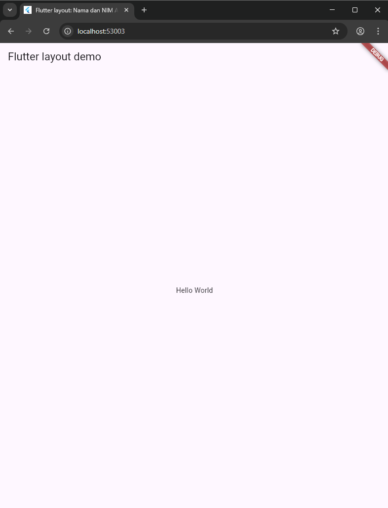
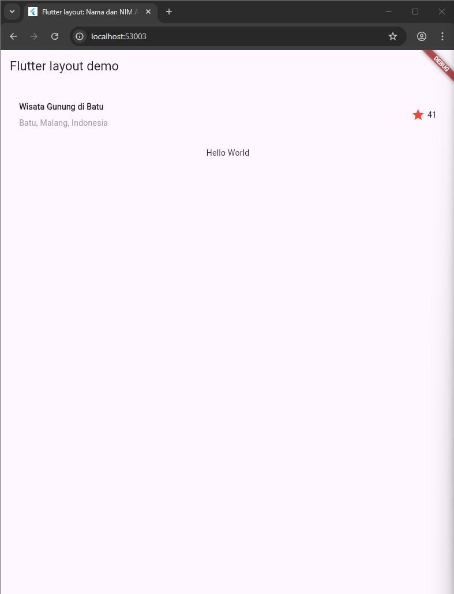
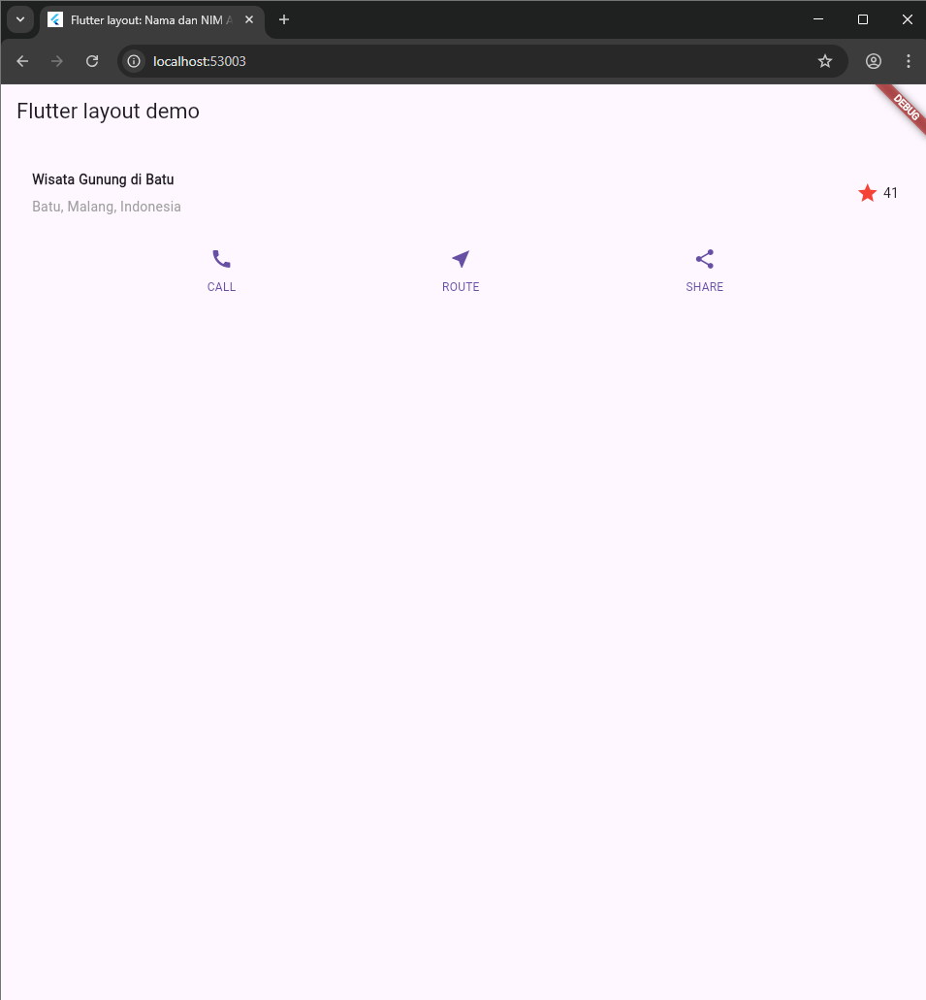
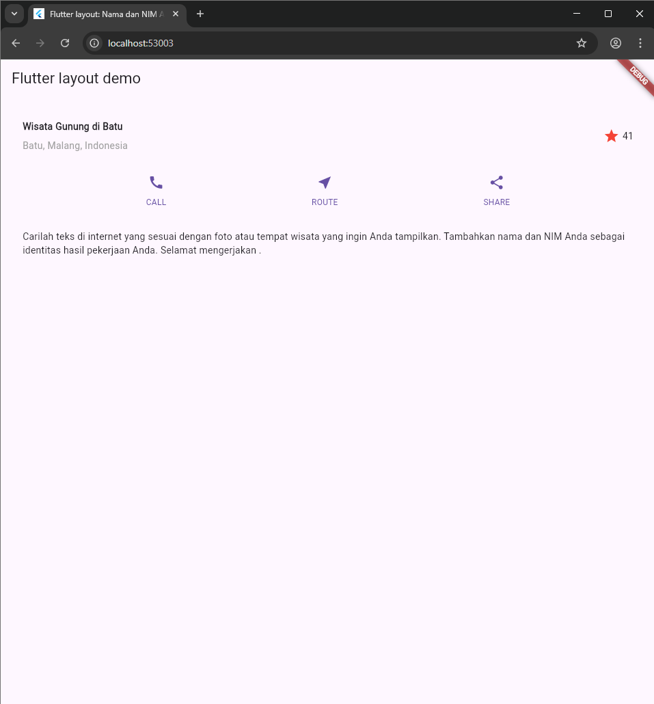
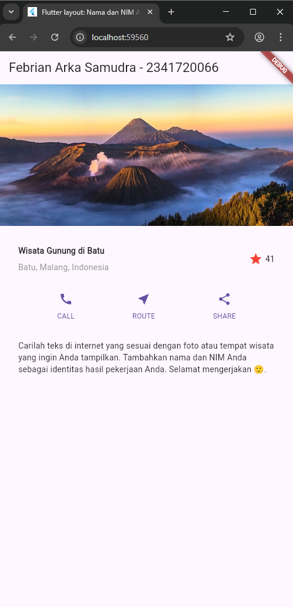

 ## note : 
- Tugas Praktikum 1
https://github.com/FebrianArkaSamudra/basic_layout_flutter

- Praktikum 5 & Tugas Praktikum 2
 https://github.com/FebrianArkaSamudra/FebrianArkaSamudra_mobile-programming/tree/main/Week%206/belanja

 
 Praktikum 1 - 4 :
 
 # *Praktikum 1: Membangun Layout di Flutter*
## **Step 1-3**

### **Explanation :**
#### Result:
A new Flutter project named layout_flutter was created using VS Code. The file main.dart was modified with the provided code, including my name and student ID in the app title. The initial application displayed an AppBar with the title Flutter layout demo and a centered text Hello World. The layout diagram was then analyzed: it consists of four main components — an image, two rows, and a block of text. The title row contains a column of two texts, a star icon, and a number, while the button row contains three columns with an icon and text in each.

## **Step 4**

### **Explanation :**
#### Result:
The title row implementation was completed by creating a titleSection widget. This section is placed inside a Container with padding and contains a Row of three elements: (1) an Expanded Column with the main title Wisata Gunung di Batu (bold) and a subtitle Batu, Malang, Indonesia (gray), (2) a red star icon, and (3) a text 41. The body of the app was then updated to display the titleSection instead of the previous Hello World text.

# *Praktikum 2: Implementasi button row*
## **Step 1-3**

### **Explanation :**
#### Result:
Step 1
In this step, a private helper method named _buildButtonColumn() was created. This method takes three parameters: a Color, an IconData, and a String label. It returns a Column widget containing an icon above a text. The text is placed inside a Container with a top margin to provide spacing from the icon. Both the icon and text use the color passed as the parameter. This approach helps avoid code duplication since each button in the row has a similar structure.

Step 2
Next, a buttonSection widget was built using a Row. Inside the row, three columns were created by calling the _buildButtonColumn() method with different parameters. The first column contains the CALL button with a phone icon, the second column is the ROUTE button with a location icon, and the third is the SHARE button with a share icon. The color is set to the app’s primary color, and MainAxisAlignment.spaceEvenly ensures equal spacing between the columns.

Step 3
Finally, the buttonSection was added to the body of the app, right below the titleSection. As a result, the application now displays the title row followed by a row of three evenly spaced buttons (CALL, ROUTE, SHARE), each with its corresponding icon and label.

# *Praktikum 3: Implementasi text section*
## **Step 1**

### **Explanation :**
#### Result:
Step 1
A new widget named textSection was created to display descriptive text under the button row. This widget is defined inside a Container with padding of 32 pixels on all sides to ensure proper spacing. The text is placed inside a Text widget with the property softWrap: true, which allows the text to automatically wrap to the next line at word boundaries when reaching the screen’s width. The instruction text was used as placeholder, with additional notes to later replace it with a description relevant to the chosen image or tourist spot, along with the student’s name and ID.

Step 2
The textSection variable was then added to the body of the application, placed after the buttonSection. As a result, the app now displays a structured layout consisting of the title row at the top, followed by the button row, and finally the descriptive text section at the bottom with proper padding and alignment.

# *Praktikum 4: Implementasi image section*
## **Step 1-3**

### **Explanation :**
#### Result:
Step 1
The first step was preparing an image asset. A new folder named images was created in the root directory of the layout_flutter project. An image file (for example, lake.jpg) was placed inside this folder. The image was then registered in the pubspec.yaml file under the assets: section with proper indentation. Since the file is case-sensitive, attention was given to the exact file name and spacing in the YAML structure. After editing, the project was restarted to apply the changes.

Step 2
Next, the image was added to the application’s body using the Image.asset widget. The property fit: BoxFit.cover was applied, ensuring the image covered its container area proportionally without distortion. This allowed the image to be displayed neatly at the top of the layout as part of the overall UI design.

Step 3
Finally, all layout components — including the image, title row, button row, and text section — were wrapped inside a ListView widget instead of a Column. The use of ListView ensures that the application layout remains scrollable on devices with smaller screens, providing a responsive design that adjusts well across different resolutions.

